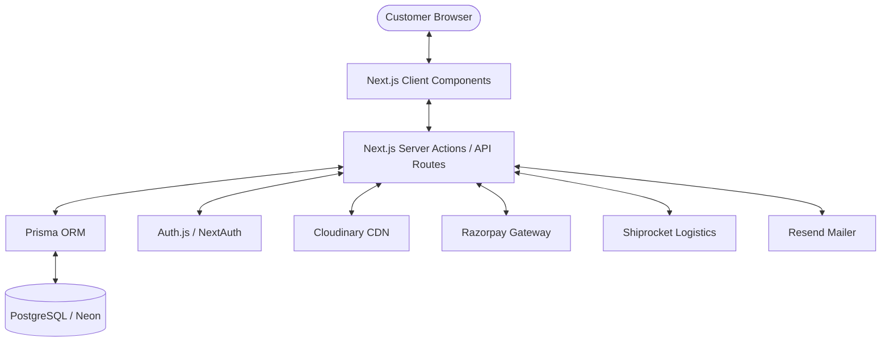
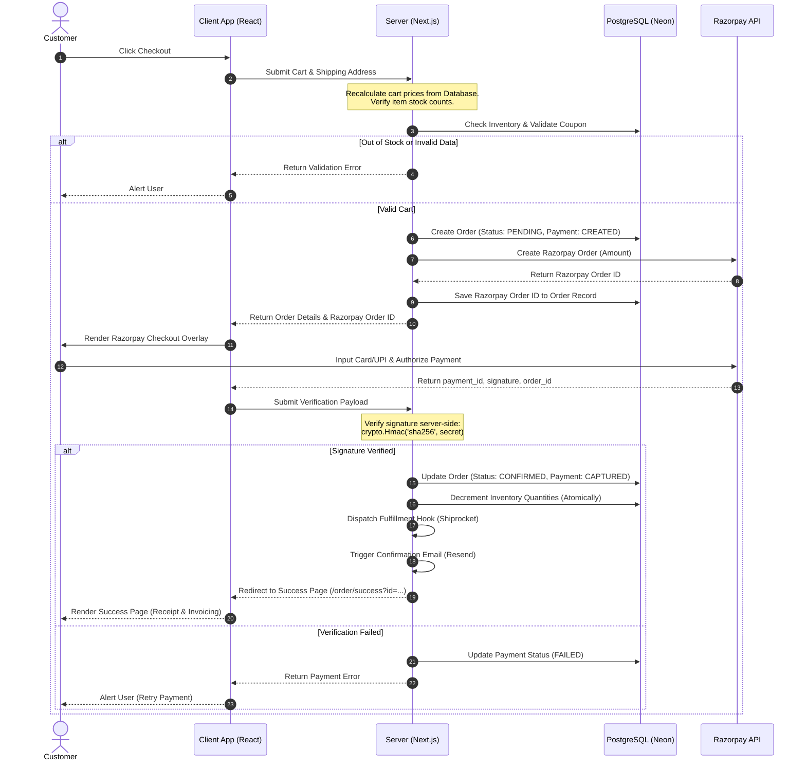

# System Architecture & Technical Design

This document details the system design, core checkout pipelines, database workflows, and external integrations for **HellFire Prints**.

---

## 1. System Overview

HellFire Prints is built using a modern decoupled architecture. Next.js serves both as the frontend user interface and the server-side backend API. Data persistence is managed via Prisma ORM connecting to a PostgreSQL server.



---

## 2. Authentication & Authorization (RBAC)

Authentication is handled via NextAuth (Auth.js) using secure JWT tokens. Role-Based Access Control (RBAC) is enforced at the database level and server boundaries.

```
Guest User (No Account) ➔ Browse Catalog, Add to Cart (Session cookie)
        ↓
Registered Customer ➔ Access Profile, Add Saved Addresses, Checkout, View Past Orders
        ↓
Admin User ➔ Access `/admin` paths, CRUD Products, Edit Inventory, Modify Shipment States
```

### Security Rules:
1. **Server-Side Verification**: Route handlers and Server Actions check the role stored in the verified session token. Client-side route blocking is used purely for user experience.
2. **API Isolation**: All administrative API endpoints `/api/admin/*` are protected behind a middleware check:
   ```typescript
   const session = await getServerSession(authOptions);
   if (!session || session.user.role !== 'ADMIN') {
     return NextResponse.json({ error: 'Unauthorized Access' }, { status: 403 });
   }
   ```

---

## 3. Core Checkout & Payment Pipeline

Recalculating prices and validating stock values server-side prevents fraud and overselling. Below is the transactional flow for a customer order:



---

## 4. Custom Poster Upload & Processing

Customers can upload custom graphics to the **Custom Poster Studio**. Image files are directly uploaded to Cloudinary:

```
Customer Uploads Image ➔ Client Crops/Rotates ➔ Server Uploads to Cloudinary
                                                         ↓
Store Cloudinary URL and Public ID in database ➔ Create custom cart item
```
Custom poster database entries are linked directly to `CartItem` or `OrderItem` tables. When an order is placed, the custom poster is marked as purchased, preventing its deletion from Cloudinary during cleanup scripts.

---

## 5. Fulfillment & Logistics (Shiprocket)

Once an order has been paid, the system triggers the shipping flow:
1. **Order Sync**: The backend transmits customer address, weight, dimensions (calculated from selected poster sizes), and invoice details to Shiprocket's API.
2. **Fulfillment Details**: Shiprocket responds with a `shipment_id` and a courier assignment.
3. **AWB Code Generation**: The system requests the Airway Bill (AWB) code and stores it in the `Shipping` model.
4. **Tracking Updates**: A cron job/webhook tracks courier status changes (e.g. `Picked Up`, `In Transit`, `Delivered`) and stores them in `ShipmentTracking` records.

---

## 6. Email Notification Workflow (Resend)

The email notification pipeline runs asynchronously using **Resend**:

- **Order Confirmed**: Triggered immediately upon payment capture.
- **Shipment Shipped**: Triggered when a tracking number (AWB) is assigned by Shiprocket.
- **Out for Delivery / Delivered**: Triggered by shipment tracking status changes.
- **Payment Failed / Refunded**: Triggers custom alerts for customer support.
