# Razorpay Test-Mode Payment Integration Documentation

This document describes the architectural design, security protocols, API routing mechanisms, and testing steps implemented for the **Razorpay Payment Integration (Test Mode)** for the **HellFire Prints** storefront.

---

## 1. Architectural Overview & Payment Lifecycle

The integration migrates the e-commerce purchase flow from a static "order-confirmed-on-place" layout to a secure, server-validated, gateway-authorized state transition system:

```mermaid
sequenceDiagram
    participant User as Browser / Client
    participant Server as Next.js Server Actions
    participant Razorpay as Razorpay API
    participant DB as Neon PostgreSQL

    User->>Server: Click "PAY ₹Total" (selected address)
    activate Server
    Server->>DB: Fetch Cart, validate stock constraints
    Server->>DB: Create local Order (Status: PENDING, PaymentStatus: CREATED)
    Server->>Razorpay: Initiate Order (total amount, receipt)
    Razorpay-->>Server: Return razorpayOrderId (rzp_order_xxx)
    Server->>DB: Save razorpayOrderId to local Order row
    Server-->>User: Return order configuration + keyId
    deactivate Server

    User->>User: Load Razorpay Standard Checkout SDK
    User->>User: Open Checkout Modal
    User->>User: Complete Test Mode payment (e.g. Netbanking Success)
    User->>Server: Send payment_id, order_id, signature
    activate Server

    Server->>DB: Fetch local Order by razorpayOrderId
    Server->>Server: Verify HMAC-SHA256 signature (timing-safe)
    
    rect rgb(30, 10, 10)
        note right of Server: Database Transaction Block
        Server->>DB: Lock inventory & decrement stock
        Server->>DB: Insert unique Payment record
        Server->>DB: Update Order status to CONFIRMED / CAPTURED
        Server->>DB: Purge User's Cart items
    end

    Server-->>User: Redirect to confirmation page (/account/orders/[id])
    deactivate Server
```



---

## 2. Security Measures & Cryptographic Verifications

### A. Key Isolation
- `NEXT_PUBLIC_RAZORPAY_KEY_ID`: Exposed to the client browser to initialize checkout.js.
- `RAZORPAY_KEY_SECRET`: Stored strictly server-side in `.env` and never loaded in client-side JS or logs.

### B. HMAC-SHA256 Signature Verification
To prevent spoofing or client-side tampering, signatures are computed strictly on the server:
$$ \text{Signature} = \text{HMAC-SHA256}(\text{razorpay\_order\_id} + "|" + \text{razorpay\_payment\_id}, \text{RAZORPAY\_KEY\_SECRET}) $$
*   **Database Source of Truth**: The `razorpay_order_id` used for verification is loaded from the database record, never trusted from the client request.
*   **Timing-Safe Comparison**: `crypto.timingSafeEqual` compares the generated signature buffer against the client's signature buffer, eliminating vulnerability to timing side-channel attacks.

### C. Idempotency Checks
- Duplicate callbacks are rejected immediately: if `order.orderStatus` is already `CONFIRMED` or if a unique `Payment` record with `razorpayPaymentId` exists in Neon, the process returns success early without repeating stock deduction or cart purges.

---

## 3. Database Schema Mapping
The system leverages the existing `Payment` and `Order` models in `prisma/schema.prisma`:
*   `Order.orderStatus` transitions: `PENDING` (during initialization) $\to$ `CONFIRMED` (upon payment signature capture).
*   `Order.paymentStatus` transitions: `CREATED` $\to$ `CAPTURED` (or `FAILED` if payment drops).
*   `Payment` stores the verified transaction markers (`razorpayOrderId`, `razorpayPaymentId`, `razorpaySignature`).

---

## 4. Webhook Foundation
- Endpoint: `/api/payments/razorpay/webhook`
- Verification: Reads raw body text and compares signature headers against `RAZORPAY_WEBHOOK_SECRET`.
- Supported events:
  - `payment.captured`: Calls the shared `processSuccessfulPayment` transaction helper to finalize the order.
  - `payment.failed`: Flags `paymentStatus` to `FAILED`.

### Local Webhook Testing Steps
To inspect webhooks locally:
1.  Expose the Next.js port (default `3000`) to the public internet using an HTTPS tunnel (e.g. `ngrok`):
    ```bash
    ngrok http 3000
    ```
2.  Copy the secure HTTPS URL generated (e.g. `https://xxxx.ngrok-free.app`).
3.  Log into your Razorpay Dashboard, go to Settings $\to$ Webhooks.
4.  Add Webhook:
    - URL: `https://xxxx.ngrok-free.app/api/payments/razorpay/webhook`
    - Secret: Choose a secret string (and set it as `RAZORPAY_WEBHOOK_SECRET` in `.env`).
    - Event Subscriptions: `payment.captured`, `payment.failed`.

---

## 5. Verification Results

### A. TypeScript Check
Types compile with **0 warnings and 0 errors**:
```bash
npx tsc --noEmit
# Exit Code: 0
```

### B. Linter Output
Lint analyses compile clean:
```bash
npm run lint
# Exit Code: 0
```

### C. Next.js Production Build
Next.js Turbopack generates clean outputs, registering routes dynamically:
```bash
Route (app)
├ ƒ /checkout
├ ƒ /api/payments/razorpay/webhook
└ ƒ /account/orders/[orderId]
```
